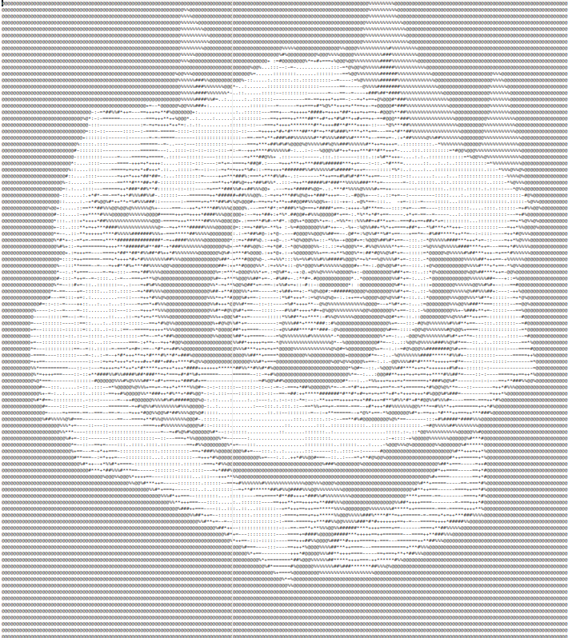

## ASCII Art Generator
A simple ASCII art generator application writen in C. It accepts BMP format image as input and creates ASCII art and stores in a text file. It's written just for fun and to understand the BMP file format.

### Compile & Run
    gcc ascii_art_gen.c -o ascii_app
    ./ascii_app

### Usage
Input image name and output text file name are stored in variables the main() function. CHange the file names as per your requirement. 
Modify NEW_MAX_WIDTH and NEW_MAX_HEIGHT to change output text's **resolution**. 
Run the executable and then open the generated text file to see the result.

Use the provided sample image for testing.

### Limitation
A lot of limitations :)
- Only 24 bits per pixel BMP images are supported
- BMP compression must be 0 (none)
- No other file format supported other than BMP

### TODO
- Use Bilinear Interpolation or Cubic Convolution for scaling image with higher accuracy
- Add support for more BMP variations
- Add support for JPG, PNG
- Clean up code

### Important Links
- Nearest Neighbour for scaling: https://tech-algorithm.com/articles/nearest-neighbor-image-scaling/
- BMP file format: https://en.wikipedia.org/wiki/BMP_file_format
- BMP image converter (suitable for this application): https://online-converting.com/image/convert2bmp/
- Awesome web-based ASCII art generator: https://manytools.org/hacker-tools/convert-images-to-ascii-art/
- Calculate scaling factor retaining aspect ratio: https://stackoverflow.com/questions/6565703/math-algorithm-fit-image-to-screen-retain-aspect-ratio